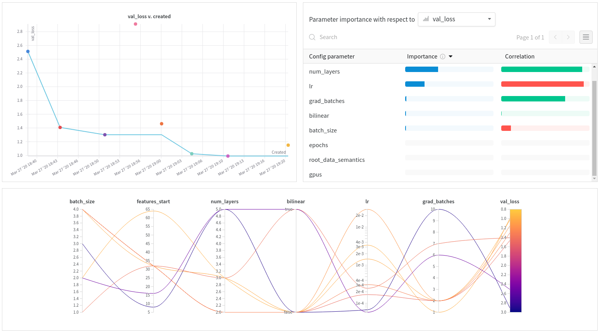

# MVLidarnet Segmentation

*MVLidarnet Segmentation with Pytorch-Lightning*

## Introduction

This is a project for performing semantic segmentation on the [Kitti dataset](http://www.cvlibs.net/datasets/kitti/eval_semseg.php) using [Pytorch-Lightning](https://pytorch-lightning.readthedocs.io/) and optimizing the neural network by monitoring and comparing runs with [Weights & Biases](https://docs.wandb.com/).

Pytorch-Ligthning includes a logger for W&B that can be called simply with:

```python
from pytorch_lightning.loggers import WandbLogger
from pytorch_lightning import Trainer

wandb_logger = WandbLogger()
trainer = Trainer(logger=wandb_logger)
```

Refer to [the documentation](https://docs.wandb.com/library/frameworks/pytorch/lightning) for more details.

Hyper-parameters can be defined manually and every run is automatically logged onto [Weights & Biases](https://www.wandb.com/) for easier analysis/interpretation of results and how to optimize the architecture.

You can also run [sweeps](https://docs.wandb.com/sweeps/) to optimize automatically hyper-parameters.


## Usage

### Script

1. 克隆本项目
2.  [Kitti dataset](http://www.cvlibs.net/datasets/kitti/eval_semseg.php) 在42服务器上，地址为/home/liuzihao/datasets
3. 本项目是利用MVlidarnet进行分割，类别映射分别为20类(./config/labels/semantic-kitti.yaml)和7类(./config/labels/semantic-kitti-7class.yaml)
4. python train.py可直接运行本代码，所有超参数存储在train.py中的hyperparameter_defaults{}中
5. 运行完代码后，log文件存储在`./wandb`下，checkpoint存储在`./mvlidarnet`下(本文件的命名为backbone的名字)
6. loss、acc、iou等日志信息在[Weights & Biases](https://www.wandb.com/) 中可以查看，需要自己先申请个账号


## Sweeps for hyper-parameter tuning

本项目可以借助wandb进行超参数寻找，超参数存储在`./sweep.yaml`文件中
1. Run `wandb sweep sweep.yaml`
2. 产生`<sweep_id>` 后，运行`wandb agent <sweep_id>`
3. Visualize and compare the sweep runs

   

Tips：`sweep.yaml`中超参数还未设置好，如果想调优的话可以自己设置下。
## Results

After running the script a few times, you will be able to compare quickly a large combination of hyperparameters.

Feel free to modify the script and define your own hyperparameters.

[See the live report → ](https://app.wandb.ai/borisd13/lightning-kitti/reports/Lightning-Kitti--Vmlldzo3MTcyMw)
